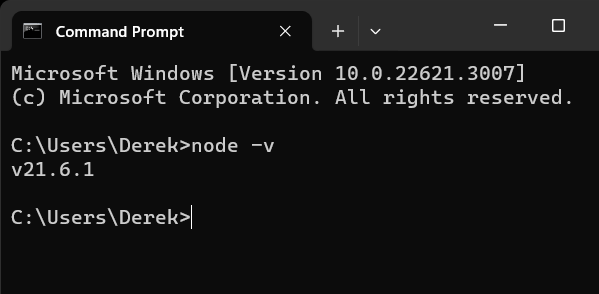

# React Js

**What is React JS?**


React.js, commonly referred to as _**React**_, is an open-source JavaScript library developed by _**Facebook**_ for building user interfaces, particularly for _**single-page applications**_. It enables developers to create large web applications that can change data without reloading the page, enhancing the user experience significantly.

## Key Features of React

* **Component-Based Architecture** : React applications are built using reusable components, which are independent pieces of code that manage their own state. This modularity allows for better organization and maintenance of code, making it easier to develop complex user interfaces.

* **JSX Syntax**: React uses _**JSX (JavaScript XML)**_, which allows developers to write HTML-like syntax directly within JavaScript code. This integration makes it intuitive to design components and visualize the UI structure.

* **Virtual DOM**: React employs a virtual DOM to optimize rendering performance. Instead of manipulating the actual DOM directly, React creates a virtual representation of the DOM. When changes occur, it efficiently updates only the parts of the DOM that need to be changed, resulting in faster rendering and improved application performance.

* **Unidirectional Data Flow**: Data in React flows in one direction from parent components to child components—making the data flow predictable and easier to debug. This unidirectional flow helps avoid issues related to cascading updates that can occur in two-way binding systems.

## Advantages of Using React

* **Fast Rendering**: The virtual DOM and efficient diffing algorithms allow React to update the user interface quickly, which is crucial for applications with high user interaction.

* **Reusability of Components**: Components can be reused across different parts of an application or even in different projects, which speeds up development and reduces redundancy.

* **Strong Community Support**: Being backed by Facebook and a large community of developers ensures continuous improvement, extensive resources, and a wealth of third-party libraries and tools available for use with React.

* **Cross-Platform Development**: With tools like React Native, developers can use React to build mobile applications for iOS and Android using the same principles and codebase as web applications.

* **Declarative Programming**: React allows developers to describe how their UI should look based on the current state of the application. When the state changes, React automatically updates the UI accordingly, simplifying the development process.

## How to Set Up React JS?


**Step 1: Install Node.js and NPM**
-----------------------------------
1. Download Node.js: Visit the [official Node.js](https://nodejs.org/en) website and download the latest _**Long Term Support (LTS)**_ version, which includes NPM (Node Package Manager).

2. Install Node.js: Run the installer and follow the on-screen instructions. Ensure that you select the option to add Node.js to your PATH during installation.

3. Verify Installation: Open your terminal or command prompt and check if Node.js and NPM are installed correctly by running:
```
node -v
npm -v
```

Here is what it looks like:


```
You should see the version numbers for both
```

Step 2: Create a New React Project
---------------
1. Create a Folder on Your Desktop: Create a new folder on your desktop, navigate to it, and open a command prompt in this directory.

2. Using Create React App: The easiest way to set up a new React project is by using Create React App. Run the following command in your terminal:
```
npx create-react-app my-app
```
Replace `my-app` with your desired project name. This command will create a new directory with all the necessary files and dependencies for your React application.

Here is what it looks like:

```
$ npx create-react-app my-app

Creating a new React app in /path/to/your/folder/my-app.

Installing packages. This might take a couple of minutes.

Installing react, react-dom, and react-scripts with cra-template...

[progress messages, downloading and installing dependencies]

Success! Created my-app at /path/to/your/folder/my-app
Inside that directory, you can run several commands:

  npm start
    Starts the development server.

  npm run build
    Bundles the app into static files for production.

  npm test
    Starts the test runner.

  npm run eject
    Removes this tool and copies build dependencies, configuration files
    and scripts into the app directory. If you do this, you can’t go back!

We suggest that you begin by typing:

  cd my-app
  npm start

Happy hacking!
```


3. Navigate to Project Directory:

Change into your newly created project directory:
```
cd my-app
```
Make sure you use the same project name `my-app`.

**Step 3: Explore Project Structure**
----------
After creating your project, you will see a structure similar to this:
```
my-app/
|-- node_modules/
|-- public/
|   |-- favicon.ico
|   |-- index.html
|-- src/
|   |-- App.css
|   |-- App.js
|   |-- index.css
|   |-- index.js
|-- package.json
```
* `src/`: Contains your main application code.
* `public/`: Holds static files like index.html.

## Step 4: Start the Development Server
To run your React application, execute the following command:
```
npm start
```
This will launch the development server and open your default web browser at http://localhost:3000/, where you can see your React app running.

Reference
- [CodeInstitute.WhatisReact.js](https://codeinstitute.net/global/blog/what-is-react-js/)
- [iCoderzSolutionsPvt.Ltd.](https://www.icoderzsolutions.com/blog/react-js-benefits/)
- [Pitiwise](https://positiwise.com/blog/10-main-advantages-of-react-js-development)
- [React.JStutorial](https://www.youtube.com/watch?v=IgWnNlq2qfw&t=10s)
- [freeCodeCamp](https://www.freecodecamp.org/news/how-to-install-react-a-step-by-step-guide/)

[def]: cmdnnode.png